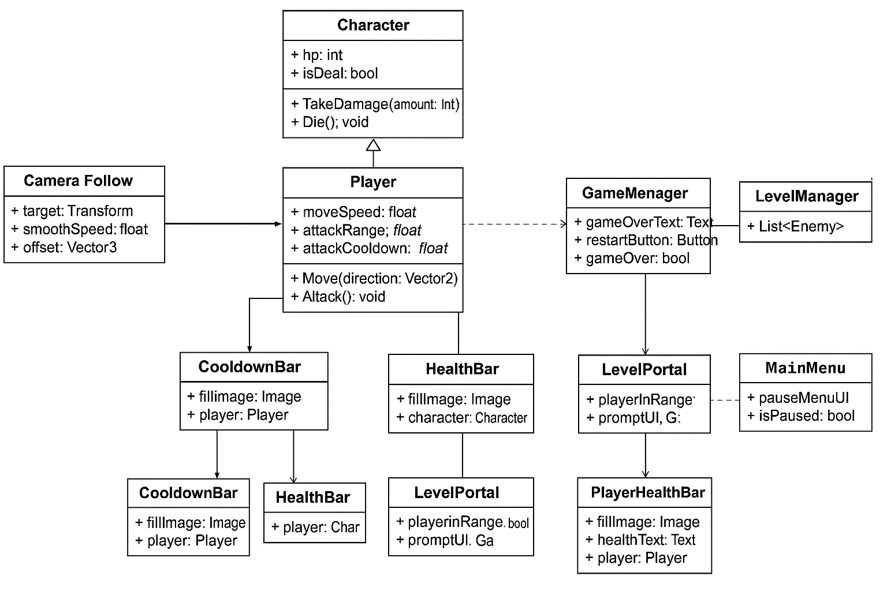

# GRA_STUDIA_RPG

## Opis projektu
**GRA_STUDIA_RPG** to klasyczna gra RPG 2D stworzona w **Unity**, osadzona w świecie dwóch wysp: wyspy zamkowej i wyspy poziomów. Gracz steruje postacią przemierzającą mapę, walczącą z przeciwnikami i awansującą na kolejne poziomy.  
Głównym celem biznesowym projektu jest **nauka oraz prezentacja umiejętności programowania obiektowego i tworzenia gier w Unity**.

## Technologie użyte w projekcie
- Unity 2022+
- C# (programowanie obiektowe)
- Tileset: Tiny Swords (grafika 64x64 px)
- TextMeshPro (do UI gracza)
- Visual Studio (do edycji kodu)

## Lista funkcjonalności

| Funkcjonalność             | Opis                                      | Screenshot                |
|:----------------------------|:-----------------------------------------|:---------------------------|
| **Ruch gracza**             | Swobodne poruszanie się po mapie          | *(screen gameplay)*        |
| **Walka**                   | Atakowanie przeciwników w zwarciu         | *(screen podczas walki)*   |
| **Cooldown ataku**          | Pasek pokazujący czas ładowania ataku     | *(screen cooldown)*        |
| **Pasek zdrowia**           | Pasek HP nad przeciwnikami i graczem      | *(screen HP)*              |
| **Sztuczna inteligencja wroga** | Wróg ściga i atakuje gracza           | *(screen wrogowie)*        |
| **Portal poziomu**          | Przejście na nowy poziom po pokonaniu wrogów | *(screen portal)*       |
| **System Game Over**        | Śmierć gracza powoduje wyświetlenie UI    | *(screen game over)*       |
| **Menu główne i pauzy**     | Start gry i zatrzymywanie rozgrywki       | *(screen menu/pauza)*      |

## Instalacja i uruchomienie

1. Sklonuj repozytorium:
   Chwilowy brak możliwości pobrania projektu, opcja pojawi za niedługo.

## Opis architektury projektu

Projekt został zbudowany w oparciu o paradygmat obiektowy (OOP).

Główne założenia OOP w projekcie:
- **Dziedziczenie**: 
  - `Player` i `Enemy` dziedziczą po wspólnej klasie `Character`, która definiuje podstawowe właściwości (`hp`, `TakeDamage()`, `Die()`).
- **Enkapsulacja**: 
  - Atrybuty takie jak `hp`, `attackCooldown` są ukryte (`private` lub `protected`) i dostępne poprzez metody.
- **Polimorfizm**: 
  - `Enemy` oraz `Player` mogą nadpisywać lub rozszerzać zachowania z `Character`.
- **Kompozycja**: 
  - `CooldownBar`, `HealthBar`, `PlayerHealthBar` są osobnymi komponentami przypisanymi do obiektów.

Dzięki takiej architekturze kod jest modularny, łatwy do rozbudowy i utrzymania.

## Diagram klas UML

Poniżej znajduje się diagram UML przedstawiający główne klasy i zależności w projekcie:

